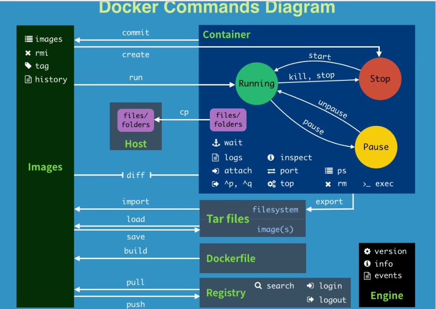

```bash


# 当前 shell 下 attach 连接指定运行镜像
attach
# 通过 Dockerfile 定制镜像 
build
# 提交当前容器为新的镜像 
commit
# 从容器中拷贝指定文件或者目录到宿主机中
cp
# 创建一个新的容器，同 run，但不启动容器 
create
# 查看 docker 容器变化           
diff
# 从 docker 服务获取容器实时事件
events
# 在已存在的容器上运行命令
exec
# 导出容器的内容流作为一个 tar 归档文件[对应 import ]
export
# 展示一个镜像形成历史
history
# 列出系统当前镜像
images
# 从tar包中的内容创建一个新的文件系统映像[对应export]
import
# 显示系统相关信息
info
# 查看容器详细信息
inspect
# kill 指定 docker 容器
kill
# 从一个 tar 包中加载一个镜像[对应 save]
load
# 注册或者登陆一个 docker 源服务器
login
# 从当前 Docker registry 退出
logout
# 输出当前容器日志信息
logs
# 查看映射端口对应的容器内部源端口
port
# 暂停容器
pause
# 列出容器列表
ps
# 从docker镜像源服务器拉取指定镜像或者库镜像
pull
# 推送指定镜像或者库镜像至docker源服务器
push
# 重启运行的容器
restart
# 移除一个或者多个容器
rm
# 移除一个或多个镜像[无容器使用该镜像才可删除，否则需删除相关容器才可继续或 -f 强制删除]
rmi
# 创建一个新的容器并运行一个命令
run
# 保存一个镜像为一个 tar 包[对应 load]
save
# 在 docker hub 中搜索镜像
search
# 启动容器
start
# 停止容器
stop
# 给源中镜像打标签
tag
# 查看容器中运行的进程信息
top
# 取消暂停容器
unpause
# 查看 docker 版本号
version
# 截取容器停止时的退出状态值
wait
```