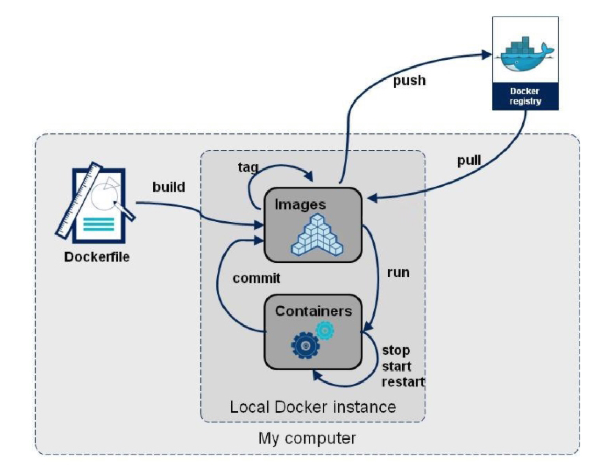
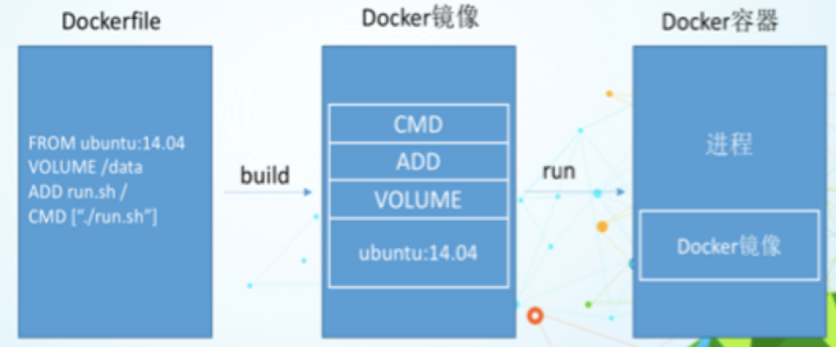

## `dockerFile`解析

### 是什么

[Dockerfile](https://docs.docker.com/engine/reference/builder/)是用来构建`Docker`镜像的文本文件，是由一条条构建镜像所需的指令和参数构成的脚本。

构建三步骤：  
- 1.编写`Dockerfile`文件
- 2.`docker build`命令构建镜像
- 3.`docker run`依镜像运行容器实例

## `Dockerfile`内容基础知识

1：每条保留字指令都必须为大写字母且后面要跟随至少一个参数

2：指令按照从上到下，顺序执行

3：`#`表示注释

4：每条指令都会创建一个新的镜像层并对镜像进行提交

`Docker`执行`Dockerfile`的大致流程：  
- 1.`docker`从基础镜像运行一个容器
- 2.执行一条指令并对容器作出修改
- 3.执行类似`docker commit`的操作提交一个新的镜像层
- 4.`docker`再基于刚提交的镜像运行一个新容器
- 5.执行`dockerfile`中的下一条指令直到所有指令都执行完成

### 小总结
  
从应用软件的角度来看，`Dockerfile`、`Docker`镜像与`Docker`容器分别代表软件的三个不同阶段：  
- `Dockerfile`是软件的原材料 
- `Docker`镜像是软件的交付品 
- `Docker`容器则可以认为是软件镜像的运行态，也即依照镜像运行的容器实例
 
`Dockerfile`面向开发，`Docker`镜像成为交付标准，`Docker`容器则涉及部署与运维，三者缺一不可，合力充当`Docker`体系的基石。 

- 1.`Dockerfile`定义了进程需要的一切东西。`Dockerfile`涉及的内容包括执行代码或者是文件、环境变量、依赖包、运行时环境、动态链接库、操作系统的发行版、服务进程和内核进程(当应用进程需要和系统服务和内核进程打交道，这时需要考虑如何设计`namespace`的权限控制)等等; 
- 2.`Docker`镜像，在用`Dockerfile`定义一个文件之后，`docker build`时会产生一个`Docker`镜像，当运行 `Docker`镜像时会真正开始提供服务; 
- 3.`Docker`容器，容器是直接提供服务的。 

## 常用保留字指令

参考tomcat8的dockerfile入门

https://github.com/docker-library/tomcat

FROM

基础镜像，当前新镜像是基于哪个镜像的，指定一个已经存在的镜像作为模板，第一条必须是from

MAINTAINER

镜像维护者的姓名和邮箱地址

RUN

容器构建时需要运行的命令

两种格式

shell格式

RUN yum -y install vim

exec格式

RUN是在 docker build时运行

EXPOSE

当前容器对外暴露出的端口

WORKDIR

指定在创建容器后，终端默认登陆的进来工作目录，一个落脚点

USER

指定该镜像以什么样的用户去执行，如果都不指定，默认是root

ENV

用来在构建镜像过程中设置环境变量

  
ENV MY_PATH /usr/mytest 
这个环境变量可以在后续的任何RUN指令中使用，这就如同在命令前面指定了环境变量前缀一样； 
也可以在其它指令中直接使用这些环境变量， 
  
比如：WORKDIR $MY_PATH 

ADD

将宿主机目录下的文件拷贝进镜像且会自动处理URL和解压tar压缩包

COPY

类似ADD，拷贝文件和目录到镜像中。
将从构建上下文目录中 <源路径> 的文件/目录复制到新的一层的镜像内的 <目标路径> 位置

COPY src dest

COPY ["src", "dest"]

<src源路径>：源文件或者源目录

<dest目标路径>：容器内的指定路径，该路径不用事先建好，路径不存在的话，会自动创建。

VOLUME

容器数据卷，用于数据保存和持久化工作

CMD

指定容器启动后的要干的事情

注意

Dockerfile 中可以有多个 CMD 指令，但只有最后一个生效，CMD 会被 docker run 之后的参数替换

参考官网Tomcat的dockerfile演示讲解

官网最后一行命令

它和前面RUN命令的区别

CMD是在docker run 时运行。

RUN是在 docker build时运行。

ENTRYPOINT

也是用来指定一个容器启动时要运行的命令

类似于 CMD 指令，但是ENTRYPOINT不会被docker run后面的命令覆盖，
而且这些命令行参数会被当作参数送给 ENTRYPOINT 指令指定的程序

命令格式和案例说明

  
命令格式：  
ENTRYPOINT可以和CMD一起用，一般是 变参 才会使用 CMD ，这里的 CMD 等于是在给 ENTRYPOINT 传参。 
当指定了ENTRYPOINT后，CMD的含义就发生了变化，不再是直接运行其命令而是将CMD的内容作为参数传递给ENTRYPOINT指令，他两个组合会变成  
 
案例如下： 假设已通过 Dockerfile 构建了  nginx:test 镜像 ： 

是否传参 
按照dockerfile编写执行 
传参运行 
Docker命令 
docker run  nginx:test 
docker run  nginx:test -c /etc/nginx/ new.conf 
衍生出的实际命令 
nginx -c /etc/nginx/nginx.conf 
nginx -c /etc/nginx/ new.conf 
  

优点

在执行docker run的时候可以指定 ENTRYPOINT 运行所需的参数。

注意

如果 Dockerfile 中如果存在多个 ENTRYPOINT 指令，仅最后一个生效。

### 小总结

