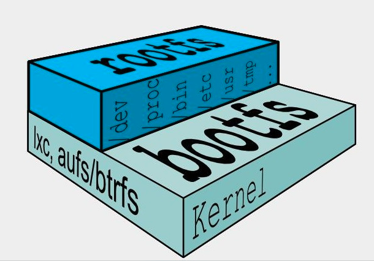

# `Docker`镜像

## `Docker`镜像是什么

镜像是一种轻量级、可执行的独立软件包，它包含运行某个软件所需的所有内容，我们把应用程序和配置依赖打包好形成一个可交付的运行环境(包括代码、运行时需要的库、环境变量和配置文件等)，这个打包好的运行环境就是image镜像文件。 
  
只有通过这个镜像文件才能生成`Docker`容器实例(类似Java中new出来一个对象)。 

### 分层的镜像

以我们的pull为例，在下载的过程中我们可以看到docker的镜像好像是在一层一层的在下载 

`UnionFS`（联合文件系统）：`Union`文件系统（`UnionFS`）是一种分层、轻量级并且高性能的文件系统，它支持对文件系统的修改作为一次提交来一层层的叠加， 同时可以将不同目录挂载到同一个虚拟文件系统下(unite several directories into a single virtual filesystem)。`Union`文件系统是`Docker`镜像的基础。镜像可以通过分层来进行继承 ，基于基础镜像（没有父镜像），可以制作各种具体的应用镜像。 

**特性：**一次同时加载多个文件系统，但从外面看起来，只能看到一个文件系统，联合加载会把各层文件系统叠加起来，这样最终的文件系统会包含所有底层的文件和目录 

### `Docker`镜像加载原理
 
`Docker`的镜像实际上由一层一层的文件系统组成，这种层级的文件系统`UnionFS`。



`bootfs`(boot file system)主要包含`bootloader`和`kernel`, `bootloader`主要是引导加载`kernel`, `Linux`刚启动时会加载`bootfs`文件系统，在`Docker`镜像的最底层是引导文件系统`bootfs`。 这一层与我们典型的`Linux/Unix`系统是一样的，包含`boot`加载器和内核。当`boot`加载完成之后整个内核就都在内存中了，此时内存的使用权已由`bootfs`转交给内核，此时系统也会卸载`bootfs`。 
 
`rootfs`(root file system) ，在`bootfs`之上 。包含的就是典型`Linux`系统中的`/dev`, `/proc`, `/bin`, `/etc`等标准目录和文件。`rootfs`就是各种不同的操作系统发行版，比如`Ubuntu`，`Centos`等等。  
 
::: info 平时我们安装进虚拟机的`CentOS`都是好几个G，为什么`Docker`这里才200M？？ 
对于一个精简的`OS`，`rootfs`可以很小，只需要包括最基本的命令、工具和程序库就可以了，因为底层直接用`Host`的`kernel`，自己只需要提供`rootfs`就行了。由此可见对于不同的`linux`发行版, `bootfs`基本是一致的, `rootfs`会有差别, 因此不同的发行版可以公用`bootfs`。
:::

::: info 为什么`Docker`镜像要采用这种分层结构呢？ 
镜像分层最大的一个好处就是共享资源，方便复制迁移，就是为了复用。 

比如说有多个镜像都从相同的`base`镜像构建而来，那么`Docker Host`只需在磁盘上保存一份`base`镜像； 
同时内存中也只需加载一份`base`镜像，就可以为所有容器服务了。而且镜像的每一层都可以被共享。
:::

::: tip 重点理解
`Docker`镜像层都是只读的，容器层是可写的。当容器启动时，一个新的可写层被加载到镜像的顶部。这一层通常被称作**容器层**，**容器层**之下的都叫**镜像层**。

所有对容器的改动 - 无论添加、删除、还是修改文件都只会发生在容器层中。只有容器层是可写的，容器层下面的所有镜像层都是只读的。
:::

### `commit`操作

`docker commit`提交容器副本使之成为一个新的镜像

```bash
docker commit -m="提交的描述信息" -a="作者" 容器ID 要创建的目标镜像名:[标签名]
```


## 阿里云
 
[阿里云开发平台](https://promotion.aliyun.com/ntms/act/kubernetes.html)

通过阿里云创建容器镜像服务，并将本地镜像送至阿里云，或者从阿里云上下载自己的镜像。

## 私有库

[Docker Hub](https://hub.docker.com/)在中国大陆访问太慢了且准备被阿里云取代的趋势，不太主流。 

`Docker hub`、阿里云这样的公共镜像仓库可能不太方便，涉及机密的公司不可能提供镜像给公网，所以需要创建一个本地私人仓库供给团队使用，基于公司内部项目构建镜像。 

`Docker Registry`是官方提供的工具，可以用于构建私有镜像仓库


将本地镜像推送到私有库

1. 下载镜像Docker Registry

docker pull registry  
 
 
 


2. 运行私有库Registry，相当于本地有个私有Docker hub

  
docker run -d -p 5000:5000  -v /zzyyuse/myregistry/:/tmp/registry --privileged=true registry 
默认情况，仓库被创建在容器的/var/lib/registry目录下，建议自行用容器卷映射，方便于宿主机联调 
 
  
 


3. 案例演示创建一个新镜像，ubuntu安装ifconfig命令

从Hub上下载ubuntu镜像到本地并成功运行

原始的Ubuntu镜像是不带着ifconfig命令的

 


外网连通的情况下，安装ifconfig命令并测试通过

docker容器内 执行上述两条命令： 
apt-get update 
apt-get install net-tools 


安装完成后，commit我们自己的新镜像

公式： 
docker commit -m=" 提交的描述信息 " -a=" 作者 "  容器 ID  要创建的目标镜像名 :[ 标签名 ] 
命令： 在容器外执行，记得 
docker commit -m=" ifconfig cmd add " -a=" zzyy " a69d7c825c4f  zzyyubuntu:1.2 
  
 


启动我们的新镜像并和原来的对比

1 官网是默认下载的Ubuntu没有ifconfig命令 
2我们自己commit构建的新镜像，新增加了ifconfig功能，可以成功使用。 
 


4. curl验证私服库上有什么镜像

 curl -XGET http://192.168.111.162:5000/v2/_catalog 
  
可以看到，目前私服库没有任何镜像上传过。。。。。。 
 


5. 将新镜像zzyyubuntu:1.2修改符合私服规范的Tag

  
按照公式： docker   tag   镜像:Tag   Host:Port/Repository:Tag 
自己host主机IP地址，填写同学你们自己的，不要粘贴错误，O(∩_∩)O 
使用命令 docker tag 将zzyyubuntu:1.2 这个镜像修改为192.168.111.162:5000/zzyyubuntu:1.2 
  
docker tag  zzyyubuntu:1.2  192.168.111.162:5000/zzyyubuntu:1.2 
  


6. 修改配置文件使之支持http
 
在`/etc/docker/daemon.json `文件中添加`insecure-registries`配置,参考如下
```json
{
  "insecure-registries": ["192.168.111.162:5000"] 
} 
```
 
上述理由：docker默认不允许http方式推送镜像，通过配置选项来取消这个限制。====>  修改完后如果不生效，建议重启docker 
 


7. push推送到私服库

docker push 192.168.111.162:5000/zzyyubuntu:1.2 


8. curl验证私服库上有什么镜像2
  
curl -XGET http://192.168.111.162:5000/v2/_catalog 
 

9. pull到本地并运行

docker pull 192.168.111.162:5000/zzyyubuntu:1.2 
docker run -it 镜像ID /bin/bash 
