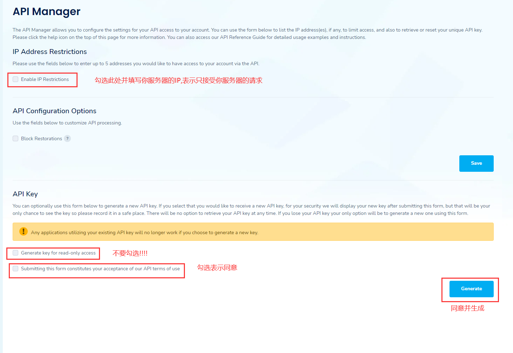

本教程记录的是通过使用`acme.sh`申请`Let's Encrypt`泛域名证书,安装证书及`nginx`配置使用证书,并通过配置实现`ssl`证书自动续期

<!-- more -->

## 环境

测试环境: `Ubuntu 20.04`、`nginx`


使用到的工具:
- [acme.sh](https://github.com/acmesh-official/acme.sh)

## `acme.sh`安装

参考[官方中文文档](https://github.com/acmesh-official/acme.sh/wiki/%E8%AF%B4%E6%98%8E)

安装:
```bash
curl https://get.acme.sh | sh -s email=my@example.com
```
默认安装到当前用户的`home`目录下`~/.acme.sh/`


建议创建一个`shell`的`alias`, 例如编辑`.bashrc`并在底部添加，方便你的使用:
```bash
alias acme.sh=~/.acme.sh/acme.sh
```
保存后`source ~/.bashrc`一下

其他安装方法: [https://github.com/Neilpang/acme.sh/wiki/How-to-install](https://github.com/Neilpang/acme.sh/wiki/How-to-install)

## 使用`DNS api`自动申请证书

首先申请对应`DNS`供应商的`DNS API KEY`,以下使用`namesilo`做演示,其他`DNS`供应商请自行搜索

[namesilo申请地址](https://www.namesilo.com/account/api-manager)

<Badge text="注意" type="warning" />由于`namesilo`网站更新过,网上其他教程的地址还是老地址,老地址配置是不生效的!



添加变量:
```bash
export Namesilo_Key="xxxxxx"
```
其他`DNS`供应商的key添加变量方法:[https://github.com/acmesh-official/acme.sh/wiki/dnsapi](https://github.com/acmesh-official/acme.sh/wiki/dnsapi)


生成证书:
```bash
acme.sh --issue --dns dns_namesilo --dnssleep 900 -d example.com -d www.example.com
```
建议将900改大为1800,因为`namesilo`解析比较慢

## 安装证书

`nginx`使用以下方式:
```bash
acme.sh --install-cert -d example.com \
--key-file       /path/to/keyfile/in/nginx/key.pem  \
--fullchain-file /path/to/fullchain/nginx/cert.pem \
--reloadcmd     "service nginx force-reload"
```
其他方式[参考文档](https://github.com/acmesh-official/acme.sh/wiki/%E8%AF%B4%E6%98%8E#3-copy%E5%AE%89%E8%A3%85-%E8%AF%81%E4%B9%A6)

如果报错需要安装`ecc`证书，用如下命令：

```bash
acme.sh --install-cert --ecc -d example.com \
--key-file       /path/to/keyfile/in/nginx/key.pem  \
--fullchain-file /path/to/fullchain/nginx/cert.pem \
--reloadcmd     "service nginx force-reload"
```

## 自动更新证书

`acme.sh`安装的时候会自动添加定时任务,确保你的机器上`crontab`正确安装,可以通过`crontab  -l`命令参看定时任务

```bash
crontab  -l

24 * * * * "/root/.acme.sh"/acme.sh --cron --home "/root/.acme.sh" > /dev/null
```

## 更新`acme.sh`

目前由于`acme`协议和`letsencrypt CA`都在频繁的更新, 因此`acme.sh`也经常更新以保持同步.

升级`acme.sh`到最新版 :

```bash
acme.sh --upgrade
```
如果你不想手动升级, 可以开启自动升级:

```bash
acme.sh --upgrade --auto-upgrade
```
之后,`acme.sh`就会自动保持更新了.

你也可以随时关闭自动更新:

```bash
acme.sh --upgrade --auto-upgrade  0
```