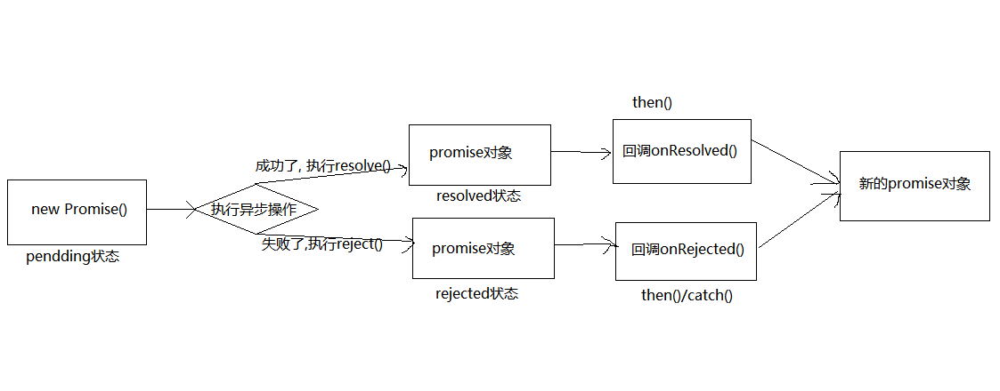

# JS异步

## `Promise`

### 1.一些常识

#### 1.1.函数对象与实例对象

    1. 函数对象: 将函数作为对象使用时, 简称为函数对象
    2. 实例对象: new 函数产生的对象, 简称为对象

#### 1.2.回调函数的分类

    1. 同步回调: 
        理解: 立即执行, 完全执行完了才结束, 不会放入回调队列中
        例子: 数组遍历相关的回调函数 / Promise的excutor函数
    2. 异步回调: 
        理解: 不会立即执行, 会放入回调队列中将来执行
        例子: 定时器回调 / ajax回调 / Promise的成功|失败的回调

#### 1.3.JS中的Error

[MDN文档](https://developer.mozilla.org/zh-CN/docs/Web/JavaScript/Reference/Global_Objects/Error)

    1. 错误的类型
        Error: 所有错误的父类型
        ReferenceError: 引用的变量不存在
        TypeError: 数据类型不正确的错误
        RangeError: 数据值不在其所允许的范围内
        SyntaxError: 语法错误
    2. 错误处理
        捕获错误: try ... catch
        抛出错误: throw error
    3. 错误对象
        message属性: 错误相关信息
        stack属性: 函数调用栈记录信息

### 2.Promise的理解和使用

#### 2.1.Promise是什么

    1.抽象表达: 
        Promise是JS中进行异步编程的新的解决方案(旧的是谁?)
    2.具体表达:
        从语法上来说: Promise是一个构造函数
        从功能上来说: promise对象用来封装一个异步操作并可以获取其结果
    3. promise的状态改变(只有2种, 只能改变一次)
        pending变为resolved
        pending变为rejected



#### 2.2.为什么要用Promise

1.指定回调函数的方式更加灵活: 可以在请求发出甚至结束后指定回调函数

- 以前: 必须在启动异步任务前指定
- promise: 启动异步任务 => 返回promie对象 => 给promise对象绑定回调函数(甚至可以在异步任务结束后指定)

2.支持链式调用, 可以解决回调地狱问题

- 什么是回调地狱? 回调函数嵌套调用, 外部回调函数异步执行的结果是嵌套的回调函数执行的条件
- 回调地狱的缺点?  不便于阅读 / 不便于异常处理
- 解决方案? `promise`链式调用
- 终极解决方案? `async/await`

#### 2.3.如何使用Promise

1.主要API

```js
new Promise(): Promise (excutor) {}
Promise.prototype.then(): (onResolved, onRejected) => {}
Promise.prototype.catch(): (onRejected) => {}
Promise.prototype.finally(): () => {}
Promise.prototype.allSettled(): () => {}
Promise.resolve(): (value) => {}
Promise.reject(): (reason) => {}
Promise.all(): (promises) => {}
Promise.race(): (promises) => {}
```

2.几个重要问题

2.1如何改变promise的状态?

```text
(1)resolve(value): 如果当前是pendding就会变为resolved
(2)reject(reason): 如果当前是pendding就会变为rejected
(3)抛出异常: 如果当前是pendding就会变为rejected
```

2.2一个promise指定多个成功/失败回调函数, 都会调用吗?

当promise改变为对应状态时都会调用
```js
const p = new Promise((resolve, reject) => {
    // resolve(1) // promise变为resolved成功状态
    // reject(2) // promise变为rejected失败状态
    // throw new Error('出错了') // 抛出异常, promse变为rejected失败状态, reason为 抛出的error
    throw 3 // 抛出异常, promse变为rejected失败状态, reason为 抛出的3
})
p.then(
    value => {console.log('value', value)},
    reason => {console.log('reason', reason)}
)
p.then(
    value => {console.log('value2', value)},
    reason => {console.log('reason2', reason)}
)
```

2.3promise.then()返回的新promise的结果状态由什么决定?

(1)简单表达: 由then()指定的回调函数执行的结果决定

(2)详细表达:

①如果抛出异常, 新promise变为rejected, reason为抛出的异常

②如果返回的是非promise的任意值, 新promise变为resolved, value为返回的值

③如果返回的是另一个新promise, 此promise的结果就会成为新promise的结果
```js
new Promise((resolve, reject) => {
    // resolve(1)
    reject(1)
}).then(
    value => {
        console.log('onResolved1()', value)
        // return 2
        // return Promise.resolve(3)
        // return Promise.reject(4)
        throw 5
    },
    reason => {
        console.log('onRejected1()', reason)
        // return 2
        // return Promise.resolve(3)
        // return Promise.reject(4)
        throw 5
    }
).then(
    value => {
        console.log('onResolved2()', value)
    },
    reason => {
        console.log('onRejected2()', reason)
    }
)
```

2.4改变promise状态和指定回调函数谁先谁后?

    (1)都有可能, 正常情况下是先指定回调再改变状态, 但也可以先改状态再指定回调

    (2)如何先改状态再指定回调?
        ①在执行器中直接调用resolve()/reject()
        ②延迟更长时间才调用then()

    (3)什么时候才能得到数据?
        ①如果先指定的回调, 那当状态发生改变时, 回调函数就会调用, 得到数据
        ②如果先改变的状态, 那当指定回调时, 回调函数就会调用, 得到数据

2.5promise如何串连多个操作任务?

(1)promise的then()返回一个新的promise, 可以看成then()的链式调用

(2)通过then的链式调用串连多个同步/异步任务
```js
new Promise((resolve, reject) => {
    setTimeout(() => {
        console.log("执行任务1(异步)")
        resolve(1)
    }, 1000);
}).then(
    value => {
        console.log('任务1的结果: ', value)
        console.log('执行任务2(同步)')
        return 2
    }
).then(
    value => {
    console.log('任务2的结果:', value)
    return new Promise((resolve, reject) => {
        // 启动任务3(异步)
        setTimeout(() => {
            console.log('执行任务3(异步))')
            resolve(3)
        }, 1000);
    })
    }
).then(
    value => {
        console.log('任务3的结果: ', value)
    }
)
```

2.6promise异常传(穿)透?

(1)当使用promise的then链式调用时, 可以在最后指定失败的回调.

(2)前面任何操作出了异常, 都会传到最后失败的回调中处理.

2.7中断promise链

(1)当使用promise的then链式调用时, 在中间中断, 不再调用后面的回调函数

(2)办法: 在回调函数中返回一个pendding状态的promise对象

### 3.自定义Promise

    1. 定义整体结构
    2. Promise构造函数的实现
    3. promise.then()/catch()的实现
    4. Promise.resolve()/reject()的实现
    5. Promise.all/race()的实现
    6. Promise.resolveDelay()/rejectDelay()的实现
    7. ES6 class版本

## async与await

    1. async 函数
        函数的返回值为promise对象
        promise对象的结果由async函数执行的返回值决定
   
    2. await 表达式
        await右侧的表达式一般为promise对象, 但也可以是其它的值
        如果表达式是promise对象, await返回的是promise成功的值
        如果表达式是其它值, 直接将此值作为await的返回值
    
    3. 注意:
        await必须写在async函数中, 但async函数中可以没有await
        如果await的promise失败了, 就会抛出异常, 需要通过try...catch来捕获处理

## JS异步之宏队列与微队列


1. 宏列队: 用来保存待执行的宏任务(回调), 比如: 定时器回调/DOM事件回调/ajax回调
2. 微列队: 用来保存待执行的微任务(回调), 比如: promise的回调/MutationObserver的回调
3. JS执行时会区别这2个队列

- JS引擎首先必须先执行所有的初始化同步任务代码
- 每次准备取出第一个宏任务执行前, 都要将所有的微任务一个一个取出来执行

## 从一道面试题深入理解`async`&`await`

异步执行顺序:
1.分析有多少个宏任务;
2.在每个宏任务中,分析有多少个微任务;
3.根据调用次序,确定宏任务中的微任务的执行次序;
4.根据宏任务的触发规则和调用次序,确定宏任务的执行次序;
5.确定整个次序

[题目](https://github.com/Advanced-Frontend/Daily-Interview-Question/issues/7)
[令人费解的async/await执行顺序](https://juejin.im/post/5c3cc981f265da616a47e028)
